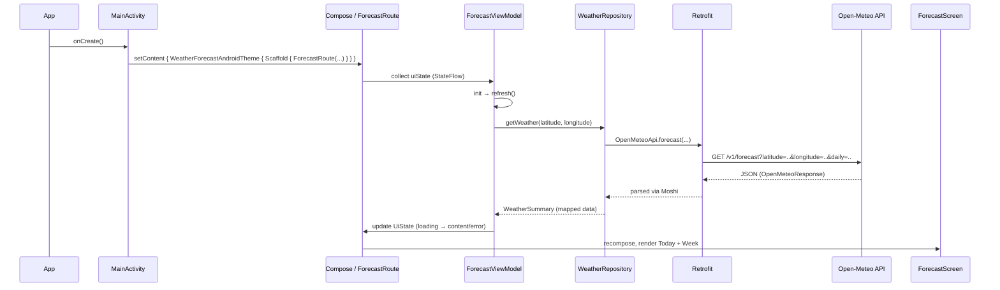

## App flow: launch → fetch weather → render UI

This document explains the end‑to‑end flow from app launch to calling the Open‑Meteo API and rendering results in the Compose UI.

### High‑level sequence

### Step‑by‑step
1. Launch and setup
   - `app/src/main/java/com/bh/weatherforecastandroid/MainActivity.kt`
   - Calls `setContent { WeatherForecastAndroidTheme { Scaffold(...) { ForecastRoute(ForecastViewModel()) } } }`.
   - Uses `contentWindowInsets = WindowInsets.safeDrawing` and applies `innerPadding` so the UI avoids notches/cutouts.

2. Route and state collection
   - `feature/forecast/ForecastRoute`
   - Collects `ForecastViewModel.uiState` with `collectAsStateWithLifecycle()` and passes `state`, `onSelectCity`, `onRefresh` to `ForecastScreen`.

3. ViewModel triggers work
   - `feature/forecast/ForecastViewModel.kt`
   - On init and on city change, `refresh()` sets loading and calls `repository.getWeather(latitude, longitude)`.
   - Catches errors to update `errorMessage` and stop loading.

4. Repository and API call
   - `core/weather/WeatherRepository.kt`
   - `create()` builds OkHttp (with logging), Moshi + `KotlinJsonAdapterFactory()`, and Retrofit; creates `OpenMeteoApi` instance.
   - `getWeather()` calls `api.forecast(...)` and maps `OpenMeteoResponse` to `WeatherSummary` (UI‑friendly model).

5. API interface
   - `core/weather/OpenMeteoApi.kt`
   - `@GET("v1/forecast")` with `@Query("latitude")`, `@Query("longitude")`, `@Query("current_weather")`, `@Query("timezone")`, `@Query("daily")`.
   - API details: see `API.md`. Example: https://api.open-meteo.com/v1/forecast?latitude=37.7749&longitude=-122.4194&current_weather=true&timezone=auto&daily=temperature_2m_max%2Ctemperature_2m_min%2Cprecipitation_probability_mean%2Cweathercode

6. UI rendering
   - `feature/forecast/ForecastScreen.kt`
   - Renders three states:
     - Loading: `CircularProgressIndicator()`
     - Error: `ElevatedCard` with error text
     - Content: Today card (current temperature) + weekly list (`ListItem` per day)
   - `CityPicker` shows predefined cities; selecting a city triggers `refresh()`.

### Data mapping
- Network → `OpenMeteoResponse` (Moshi)
- Repository → `WeatherSummary` containing:
  - `currentTempC: Double?`
  - `daily: List<DailyForecast>` with `dateIso`, `tempMinC`, `tempMaxC`, `precipProbabilityPct`, `weatherCode`

### Error handling and retries
- Any exception during `refresh()` is caught in `ForecastViewModel`, sets `errorMessage` for the UI.
- The UI exposes a Refresh action to re‑trigger `refresh()`.

### Files of interest
- `app/MainActivity.kt` — entry point, theme, safe area, loads `ForecastRoute`.
- `feature/forecast/ForecastViewModel.kt` — orchestrates loading and state.
- `feature/forecast/ForecastScreen.kt` — UI states and lists; `CityPicker`.
- `core/weather/WeatherRepository.kt` — Retrofit/Moshi setup, network call, mapping.
- `core/weather/OpenMeteoApi.kt` — Retrofit interface.

### Extensibility
- DI (Hilt/Koin) to inject `WeatherRepository` and `OpenMeteoApi`.
- Add `core:domain` use cases and move data impl to `core:data` for stricter Clean Architecture.
- Extract a shared design system to `core:ui` if multiple features are added.

