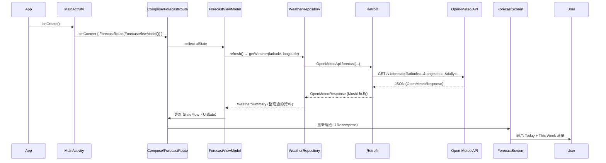

## App 啟動 → 取得天氣資料 → 渲染 UI 的流程

本文件說明從 `MainActivity` 啟動後，到呼叫 Open‑Meteo API 取得資料，並最終在 Compose UI 上展示的整體流程。

### 序列圖（高層）

### 詳細步驟
1. 啟動與組裝
   - `app/src/main/java/com/bh/weatherforecastandroid/MainActivity.kt` 在 `onCreate` 中呼叫 `setContent { WeatherForecastAndroidTheme { Scaffold { ForecastRoute(...) } } }`。
   - `Scaffold` 設定 `contentWindowInsets = WindowInsets.safeDrawing`，內容套用 `innerPadding`，避開瀏海/膠囊。

2. 路由與狀態蒐集
   - `feature/forecast/ForecastRoute` 使用 `collectAsStateWithLifecycle()` 監聽 `ForecastViewModel.uiState`，並將 `state`、`onSelectCity`、`onRefresh` 傳給 `ForecastScreen`。

3. ViewModel 啟動請求
   - `feature/forecast/ForecastViewModel.kt`
     - 初始化時呼叫 `refresh()`。
     - `refresh()` 會：
       - 將 `UiState` 設為 loading。
       - 呼叫 `WeatherRepository.getWeather(latitude, longitude)`。
       - 成功：更新 `summary` 與 `isLoading=false`。
       - 失敗：填入 `errorMessage`。

4. Repository 建立 Retrofit 並呼叫 API
   - `core/weather/WeatherRepository.kt`
     - `companion object.create()` 建立 `OkHttpClient`（含 logging）、`Moshi`（加入 `KotlinJsonAdapterFactory()`）、`Retrofit`，並建立 `OpenMeteoApi` 實例。
     - `getWeather()` 透過 `api.forecast(...)` 取得 `OpenMeteoResponse`，整理為 `WeatherSummary`（包含今日溫度與每日日預報清單）。

5. API 介面定義
   - `core/weather/OpenMeteoApi.kt`
     - 使用 `@GET("v1/forecast")` 與 `@Query(...)` 定義必要參數（`latitude`、`longitude`、`daily` 等）。

6. UI 呈現
   - `feature/forecast/ForecastScreen.kt`
     - 使用 Material 3：`ElevatedCard` 顯示今日資訊、`ListItem` 清單顯示一週預報。
     - 依 `UiState` 三態切換：Loading、Error、Content。
     - 城市選單 `CityPicker` 切換城市後會再次 `refresh()`。

### 關鍵檔案與職責
- `app/MainActivity.kt`：App 入口、主題、安全區處理、載入 `ForecastRoute`。
- `feature/forecast/ForecastViewModel.kt`：負責取得資料、管理 `UiState`、處理錯誤。
- `feature/forecast/ForecastScreen.kt`：根據 `UiState` 顯示 Loading/Error/Content、城市選擇、列表渲染。
- `core/weather/WeatherRepository.kt`：呼叫 API、轉換 `OpenMeteoResponse` → `WeatherSummary`。
- `core/weather/OpenMeteoApi.kt`：定義 Retrofit 介面。

### 錯誤處理與預覽
- 任何 API 例外會被 `ForecastViewModel.refresh()` 捕捉，UI 顯示 `errorMessage`。
- Compose Preview 需求：`implementation(ui-tooling-preview)` 與 `debugImplementation(ui-tooling)`。

### 可擴充點
- 新功能：新增於 `feature/<name>`。
- 更嚴謹的分層：可引入 `core:domain`（use cases）、將 `WeatherRepository` 置於 `core:data`，介面定義於 domain。
- DI：可用 Hilt/Koin 注入 `OpenMeteoApi` 與 `WeatherRepository`。

