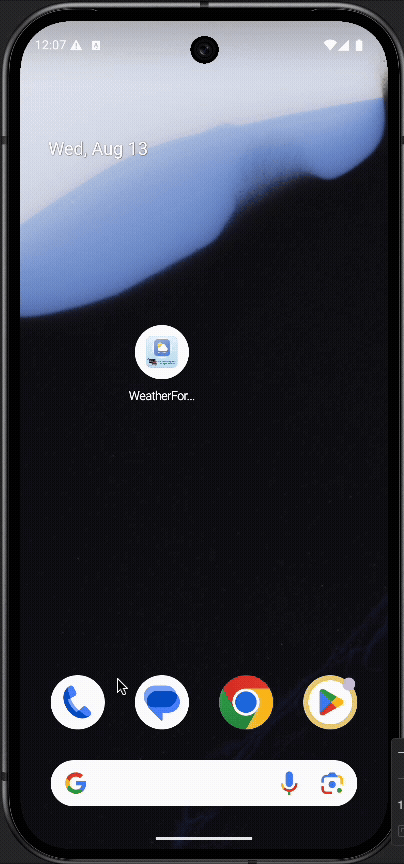

## WeatherForecastAndroid

An Android sample app built with Kotlin and Jetpack Compose that displays current weather and a 7‑day forecast using the Open‑Meteo API (no API key required).

<p>
  
  
</p>

### Overview
- Fetches weather data from `https://api.open-meteo.com/` via Retrofit + Moshi
- Modern Compose UI with Material 3 components and safe‑area handling
- Simple multi‑module architecture for faster builds and clear boundaries

### Project structure
```
app/                      # Application module – entry point and app theming
core/weather/             # Data layer for weather (Retrofit API, models, repository)
feature/forecast/         # Forecast feature (UI + ViewModel)
```
- `app`: wires the app and hosts `MainActivity`. Uses a `Scaffold` with `WindowInsets.safeDrawing` so the UI avoids cutouts/notches.
- `core/weather`: contains `OpenMeteoApi`, data models, and `WeatherRepository`. Retrofit is configured with Moshi and `KotlinJsonAdapterFactory()`.
- `feature/forecast`: contains `ForecastScreen` and `ForecastViewModel` that call the repository and render the UI.

### Tech stack
- Language: Kotlin
- UI: Jetpack Compose, Material 3
- Networking: Retrofit, OkHttp (with logging)
- JSON: Moshi (+ `KotlinJsonAdapterFactory`)
- Concurrency: Kotlin Coroutines
- Lifecycle: AndroidX Lifecycle ViewModel

### Requirements
- Android Studio (Koala or newer)
- Android Gradle Plugin 8.x (configured via Gradle wrapper)
- Compile SDK 36, Min SDK 24, JVM target 11

### Getting started
1. Open the project in Android Studio.
2. Sync Gradle.
3. Run the `app` configuration on an emulator or device.

Command‑line builds:
```bash
./gradlew assembleDebug
./gradlew installDebug
```

### API and permissions
- API: Uses Open‑Meteo, which does not require an API key.
- Base URL: `https://api.open-meteo.com/`
- Permission: `android.permission.INTERNET` is declared in `core/weather` and is merged into the final app manifest. You can move it to `app/src/main/AndroidManifest.xml` if you prefer centralizing permissions in the app module.
- API details: see [API.md](API.md). Example request: [`forecast`](https://api.open-meteo.com/v1/forecast?latitude=37.7749&longitude=-122.4194&current_weather=true&timezone=auto&daily=temperature_2m_max%2Ctemperature_2m_min%2Cprecipitation_probability_mean%2Cweathercode)

### UI notes
- The top bar/title area respects the device safe area using `WindowInsets.safeDrawing` and applies `innerPadding` from `Scaffold`.
- The forecast list uses Material 3 `ListItem`, `ElevatedCard`, `AssistChip`, and dividers; simple emoji icons are shown per weather code.

### Configuration tips
- Default cities are defined in `feature/forecast/ForecastViewModel.kt` → `City.Predefined.cities`.
- `WeatherRepository.create()` builds a Retrofit instance with Moshi + `KotlinJsonAdapterFactory()`.

### Switching to OpenWeatherMap (optional)
If you want to use OpenWeatherMap instead of Open‑Meteo:
1. Add an API key to `local.properties` (not committed): `OPEN_WEATHER_API_KEY=YOUR_KEY`.
2. Expose it via `build.gradle.kts` using `buildConfigField`.
3. Update the API interface to include `@Query("appid") BuildConfig.OPEN_WEATHER_API_KEY` and change the base URL.

### Tests
Basic unit/instrumentation test stubs are included (`test/` and `androidTest/`). Run from Android Studio or:
```bash
./gradlew test
./gradlew connectedAndroidTest
```

### Module dependencies
```
app
 └── feature:forecast
      └── core:weather
```
- `app` depends on `feature:forecast` and optionally may depend on `core:weather` directly if needed.
- `feature:forecast` depends on `core:weather`.

### Build variants and previews
- Compose Previews require the tooling dependency in feature modules:
  - `implementation(libs.androidx.ui.tooling.preview)`
  - `debugImplementation(libs.androidx.ui.tooling)`
- If Preview fails with missing `ComposeViewAdapter`, sync Gradle and ensure the above dependencies are present.

### Troubleshooting
- Conversion error like “Unable to create converter for OpenMeteoResponse”: ensure Moshi is initialized with `KotlinJsonAdapterFactory()` (already configured in `WeatherRepository.create()`).
- Title overlapped by camera cutout/notch: safe area is handled via `WindowInsets.safeDrawing` and `innerPadding` in `MainActivity`.
- Preview crashes: use the `Debug` variant and keep `ui-tooling` as a `debugImplementation` only.

### Customization
- Replace emoji with real icons (Vector assets) or a weather icon pack.
- Move manifest permissions from `core/weather` to `app` if you prefer centralized permission governance.
- Add more features as separate modules under `feature/` (e.g., `feature/settings`).
- Split `core` by layer if needed: `core/data`, `core/domain`, `core/ui`.


