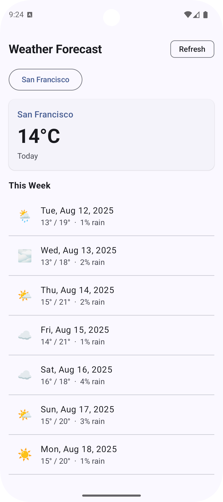

## WeatherForecastAndroid（中文說明）

一個以 Kotlin 與 Jetpack Compose 打造的 Android 天氣範例 App，使用 Open‑Meteo API 顯示即時天氣與 7 日預報（不需 API Key）。



### 概覽
- 使用 `https://api.open-meteo.com/` 透過 Retrofit + Moshi 取得天氣資料
- Compose + Material 3 介面，支援安全區（safe area）
- 多模組架構，縮短編譯時間並明確職責

### 專案結構
```
app/                      # App 模組：進入點、主題與組裝
core/weather/             # 核心資料層：API、資料模型、Repository
feature/forecast/         # 天氣預報功能模組：UI + ViewModel
```
- `app`：承載 `MainActivity`，`Scaffold` 啟用 `WindowInsets.safeDrawing` 避開瀏海/膠囊。
- `core/weather`：包含 `OpenMeteoApi`、資料模型與 `WeatherRepository`，Moshi 以 `KotlinJsonAdapterFactory()` 初始化。
- `feature/forecast`：`ForecastScreen` 與 `ForecastViewModel`，負責向 Repository 取資料並顯示。

### 技術棧
- 語言：Kotlin
- UI：Jetpack Compose、Material 3
- 網路：Retrofit、OkHttp（含 Logging）
- JSON：Moshi（含 `KotlinJsonAdapterFactory`）
- 併發：Kotlin Coroutines
- 生命週期：AndroidX Lifecycle ViewModel

### 環境需求
- Android Studio（Koala 或更新版）
- Android Gradle Plugin 8.x（專案已設定 Gradle wrapper）
- Compile SDK 36、Min SDK 24、JVM target 11

### 快速開始
1. 在 Android Studio 開啟專案
2. 同步 Gradle
3. 執行 `app` 模組至模擬器或實機

命令列建置：
```bash
./gradlew assembleDebug
./gradlew installDebug
```

### API 與權限
- API：使用 Open‑Meteo，不需 API Key
- Base URL：`https://api.open-meteo.com/`
- 權限：`android.permission.INTERNET` 目前宣告於 `core/weather`，會在打包時合併至 App Manifest。如需集中管理，可移至 `app/src/main/AndroidManifest.xml`。
- API 詳細說明：請見 [API.md](API.md)。範例請求：[`forecast`](https://api.open-meteo.com/v1/forecast?latitude=37.7749&longitude=-122.4194&current_weather=true&timezone=auto&daily=temperature_2m_max%2Ctemperature_2m_min%2Cprecipitation_probability_mean%2Cweathercode)

### UI 說明
- 透過 `WindowInsets.safeDrawing` 與 `Scaffold` 的 `innerPadding` 處理安全區，避免標題被瀏海/膠囊遮住。
- 清單使用 Material 3 的 `ListItem`、`ElevatedCard`、`AssistChip` 與分隔線；以簡單 emoji 表示天氣代碼。

### 模組依賴圖
```
app
 └── feature:forecast
      └── core:weather
```

### 預覽與排錯
- Compose Preview 需要：
  - `implementation(libs.androidx.ui.tooling.preview)`
  - `debugImplementation(libs.androidx.ui.tooling)`
- 若出現缺少 `ComposeViewAdapter`：請同步 Gradle 並確認上述依賴已加入。
- 若 Moshi 無法建立轉換器：確認已使用 `KotlinJsonAdapterFactory()`（已在 `WeatherRepository.create()` 設定）。

### 測試
從 Android Studio 執行或使用命令列：
```bash
./gradlew test
./gradlew connectedAndroidTest
```
專案包含：
- `core/weather` 的 `WeatherRepositoryTest`
- `feature/forecast` 的 `ForecastViewModelTest`
- `app` 的基本單元測試樣例

### 自訂化
- 將 emoji 改為真正的向量圖示或 icon 套件
- 權限移至 `app` 模組以集中治理
- 新功能請新增於 `feature/<name>`
- 需要更細分時，可將 `core` 拆為 `core/data`、`core/domain`、`core/ui`

### 切換至 OpenWeatherMap（可選）
1. 在 `local.properties`（不入版控）新增：`OPEN_WEATHER_API_KEY=你的金鑰`
2. 在對應模組的 `build.gradle.kts` 暴露為 `buildConfigField`
3. 調整 API 介面：新增 `@Query("appid")` 參數並切換 Base URL
